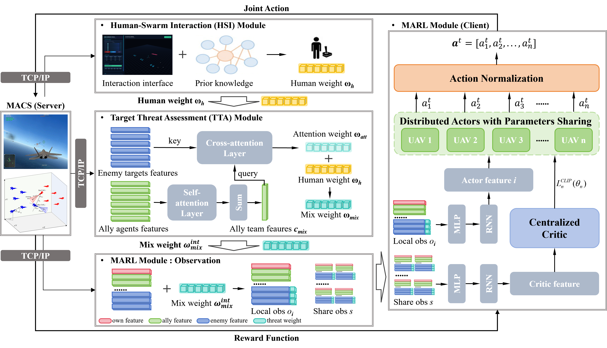
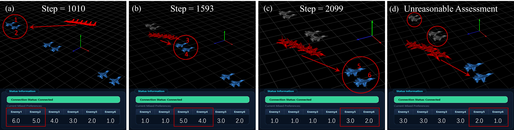
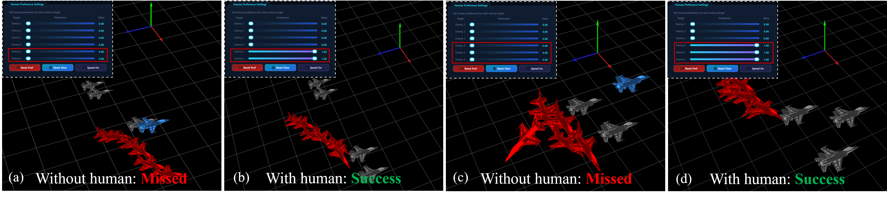

# MARL_TTA_HSI
A Generalizable Human-on-the-Loop Threat-Aware MARL Framework for Multi-agent Confrontation

## Project Overview
A human-on-the-loop, threat-aware MARL framework with TTA and HSI module for efficient and generalizable multi-UAV confrontation in high-fidelity Harfang3D simulations.

## Architecture

### Framework
We develop the human-on-the-loop threat-aware MARL framework that comprises three core modules: (1) the Multi-Agent Reinforcement Learning (MARL) module, (2) the Target Threat Assessment (TTA) module, and (3) the Human-Swarm Interaction (HSI) module. These modules operate synergistically to achieve improved decision-making in MACS.



### Human-Swarm Interaction Interface
The human-swarm interaction interface establishes a bidirectional TCP/IP communication channel with both the MARL algorithm and the MACS, enabling real-time data exchange. This interface comprises two primary components: (1) an interactive control panel and (2) a 3D situational display. The 3D visualization module provides an intuitive representation of the confrontation scenario.


### Repository Structure
- `HSI_UI/`: Human-swarm interaction GUI design (PyQt6/OpenGL).
- `algorithms/`: Mappo with TTA module.
- `envs/`: Environment design/setting for reinforcement learning.
- `runner/`: Training framework.
- `scripts/`: Train/render start.
- `weights/`: Pretrained weights.
- `config.py/`: Parameter settings.

### Quick Start
```python
python scripts/train/train_hafang_weight.py
--env-name MultipleCombat --algorithm-name mappo --seed 0 --n-training-threads 1 --n-rollout-threads 1 --log-interval 1 --save-interval 1
--num-mini-batch 2 --buffer-size 6000 --num-env-steps 1e8 --lr 1e-4 --gamma 0.99 --ppo-epoch 8 --clip-params 0.2 --max-grad-norm 2
--entropy-coef 1e-3 --hidden-size "256 128" --act-hidden-size "256 128" --recurrent-hidden-size 128 --recurrent-hidden-layers 1 --data-chunk-length 8
```

### Results




### Acknowledgements / References
Simulation backend is based on the Harfang3D Dog-Fight Sandbox. Please cite:
```bibtex
@misc{2210.07282,
  Author = {Muhammed Murat Özbek,  Süleyman Yıldırım,  Muhammet Aksoy, Eric Kernin and Emre Koyuncu},
  Title = {Harfang3D Dog-Fight Sandbox: A Reinforcement Learning Research Platform for the Customized Control Tasks of Fighter Aircrafts},
  publisher = {arXiv},
  doi = {10.48550/ARXIV.2210.07282},
  Year = {2022},
  Eprint = {arXiv:2210.07282},
}
```

